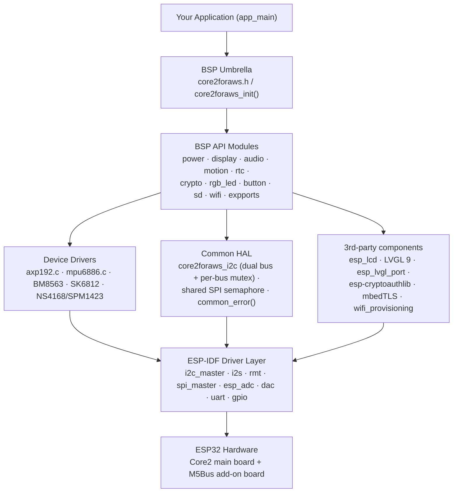
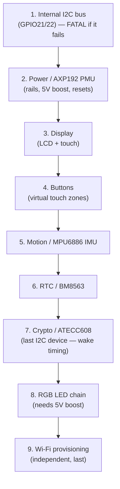
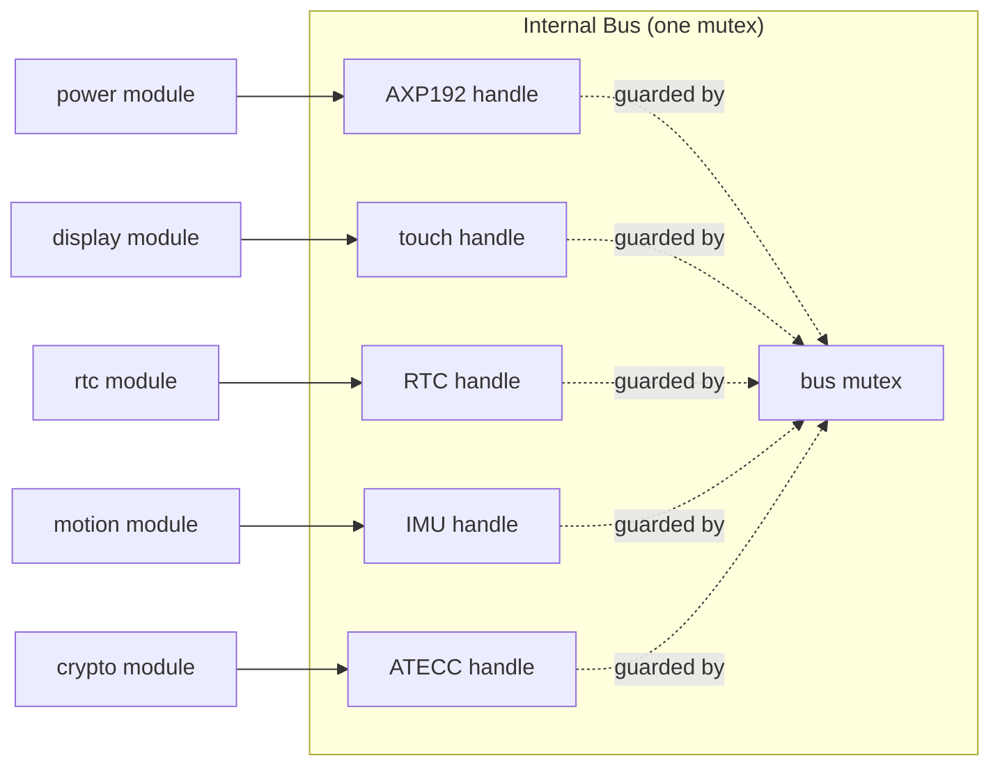

# Design Document — M5Stack Core2 for AWS IoT Kit BSP

> **Audience:** Embedded/IoT developers who are newer to ESP32, ESP-IDF, and
> board support packages (BSPs). This document explains *what* the BSP is, *how*
> it is structured, and — most importantly — *why* it is built this way. The two
> guiding goals of this project are **stability** and **ease of understanding**.

> **Living document.** This design doc is expected to evolve alongside the BSP.
> When the code changes (init flow, public APIs, modules, shared-resource
> handling, power, build config, or pin usage), this document must be updated in
> the same change. The maintenance contract is defined in
> [.claude/rules/design-doc.md](rules/design-doc.md).

---

## 1. What this BSP is (and is not)

A **Board Support Package (BSP)** is a layer of software that sits between your
application and the physical hardware. Its job is to hide the messy,
board-specific details — exact GPIO pin numbers, power sequencing, shared-bus
arbitration — so that your application can say "turn on the speaker" instead of
"set AXP192 register 0x12 bit 2, wait, then configure the I2S controller."

This BSP targets the **M5Stack Core2 for AWS IoT Kit** specifically. That kit is
**not** the same as the standard M5Stack Core2:

- It adds an **M5Bus add-on board** carrying a microphone, a 10-pixel addressable
  RGB LED strip, an MPU6886 IMU, and an **ATECC608 secure element** (used for AWS
  IoT device identity).
- Because of this, several "free-looking" GPIOs are actually committed to add-on
  hardware. The BSP encodes the *correct* wiring so you never have to guess.

**What it is:** a curated set of drivers + a single `core2foraws_init()` entry
point, written for ESP-IDF v5.3 (with v4.x compatibility branches).

**What it is not:** a general-purpose ESP32 devkit library. Do not assume
standard ESP32 devkit pin defaults — this board reuses many pins for specific
purposes.

---

## 2. Design goals and principles

| Principle | What it means in practice |
| --- | --- |
| **Stability first** | Shared hardware (buses, the audio clock) is always protected by a lock. Init is idempotent — calling it twice is safe. Failures are reported, not hidden. |
| **One obvious entry point** | The application includes only [core2foraws.h](../include/core2foraws.h) and calls `core2foraws_init()`. Everything else is opt-in. |
| **Hardware truth, encoded once** | Pin maps, power sequencing, and shared-bus rules live in the BSP, not in your app. See [.claude/rules/pinmap.md](rules/pinmap.md) and [.claude/rules/board.md](rules/board.md). |
| **Predictable error handling** | Every public function returns `esp_err_t`. You can always check success the same way. |
| **Readable over clever** | Custom chip drivers use a simple function-pointer injection pattern so they read top-to-bottom without hidden global state. |
| **Pay only for what you use** | Each module is gated behind a `CONFIG_SOFTWARE_*` Kconfig flag. Unused modules are not compiled or initialized. |

---

## 3. The big picture (layered architecture)

The BSP is organized into clear layers. Data and control flow downward; each
layer only knows about the one directly below it.



**How to read this:**

1. **Application layer** — your code. It includes one header and calls one init
   function.
2. **BSP API layer** — the `core2foraws_<module>_*` functions. This is the public
   surface you call. It is board-aware and hides pin numbers and sequencing.
3. **Device-driver layer** — self-contained chip drivers (e.g. `axp192.c`,
   `mpu6886.c`). These are pure logic; they receive a "how to talk to I2C"
   function from the layer above instead of calling ESP-IDF directly.
4. **Common HAL layer** — the shared-resource managers. This is where the two I2C
   buses, the one shared SPI bus, and the single audio clock are coordinated.
   **This layer is the heart of the "stability" goal.**
5. **ESP-IDF + managed components** — Espressif's official drivers and third-party
   libraries.

---

## 4. The single entry point: `core2foraws_init()`

The application's first BSP call is almost always:

```c
#include "core2foraws.h"

void app_main( void )
{
    core2foraws_init();   // brings up everything that is enabled in menuconfig
    // ... your code ...
}
```

Internally, `core2foraws_init()` brings subsystems up **in a deliberate order**.
Order matters because later subsystems depend on earlier ones (for power rails or
the I2C bus). Each step is compiled in only if its Kconfig flag is enabled.



**Key design decisions in this sequence:**

- **The internal I2C bus comes first and is the only fatal step.** Almost every
  on-board chip (PMU, touch, RTC, IMU, secure element) lives on this bus. If it
  cannot come up, nothing else can, so `init` returns early.
- **Power (AXP192) comes second.** The PMU owns the rails that feed the display,
  the SD card, the vibration motor, and the 5V boost for the LED strip. It also
  drives the shared LCD/touch reset line. Bringing it up early means downstream
  peripherals have stable power before they are probed.
- **Crypto (ATECC608) comes after the other I2C devices.** The secure element has
  a finicky "wake" pulse; doing it last keeps that special handling out of the
  way of simpler devices.
- **Most failures are non-fatal.** After the I2C bus, each step's result is
  accumulated (`ret |= err`). A single bad peripheral is reported but does not
  stop the rest of the board from coming up — important for stability and for a
  good first-time developer experience.
- **Audio and SD card are intentionally *not* in this list.** They are brought up
  on demand by the application, because they hold scarce shared resources (the
  I2S controller, the SPI bus) that you should claim only when needed.

---

## 5. The Common HAL — where stability is enforced

This is the most important part of the design to understand. The board has
several **shared hardware resources** that multiple peripherals fight over. The
Common HAL is the referee.

### 5.1 Two separate I2C buses

The board has **two physically distinct I2C buses**, and the BSP keeps them
distinct on purpose:

| Bus | Pins | Who lives there |
| --- | --- | --- |
| **Internal** (`CORE2FORAWS_I2C_INTERNAL`, I2C_NUM_0) | SDA=GPIO21, SCL=GPIO22 | AXP192 PMU, FT6336 touch, BM8563 RTC, MPU6886 IMU, ATECC608 secure element |
| **External / Port A** (`CORE2FORAWS_I2C_EXTERNAL`, I2C_NUM_1) | SDA=GPIO32, SCL=GPIO33 | Your external Grove "unit" accessories only |

A common beginner mistake is to assume the IMU or secure element is on the
external bus. **They are not** — they reach the internal bus through the M5Bus
connector. The BSP encodes this correctly so you never have to.

### 5.2 The device-handle + per-bus mutex pattern

The BSP uses ESP-IDF's modern `i2c_master.h` API (a "bus + device handle"
model). The pattern is:



- Each peripheral registers itself once with
  `core2foraws_i2c_device_add(port, addr, speed, &handle)` and keeps its own
  handle.
- Every read/write goes through `core2foraws_i2c_read/write`, which **takes the
  per-bus mutex, does the transfer, then releases it.** This means two FreeRTOS
  tasks can never corrupt each other's I2C transaction — the central guarantee
  behind the BSP's stability.
- For rare cases that need several operations to be atomic (the secure element's
  wake pulse), `core2foraws_i2c_lock()/unlock()` expose the mutex directly.

This pattern is also why init is **idempotent**: calling
`core2foraws_i2c_init()` again on an already-running bus simply returns `ESP_OK`.

### 5.3 The shared SPI bus (LCD + SD card)

The LCD and the SD card **share one SPI controller** (MOSI=23, MISO=38, SCK=18)
with separate chip-selects (LCD CS=5, SD CS=4). They are coordinated by a single
shared semaphore, `core2foraws_common_spi_semaphore`, created lazily by whichever
of the display or SD module initializes first. Any code touching the SD card
takes this semaphore so it cannot collide with an LCD refresh.

### 5.4 The shared audio clock (GPIO0)

The speaker amp (NS4168) and the microphone (SPM1423) **share GPIO0** and the
single `I2S_NUM_0` controller. They are therefore **mutually exclusive** — you
can play *or* record, but not both at once. The audio module enforces this with a
static mutex and state flags; calling `speaker_write()` while the mic is enabled
returns `ESP_ERR_INVALID_STATE`. This is a hardware constraint, not a software
limitation, and the BSP makes the constraint explicit instead of letting you trip
over it silently.

### 5.5 Buffer placement — internal DRAM vs. PSRAM

The board has 8 MB of external PSRAM but only a small internal DRAM pool. PSRAM
is **not** DMA-addressable and is slower for the CPU; internal DRAM is scarce but
DMA-capable and fast. The BSP keeps every DMA- or latency-critical buffer in
internal DRAM and leaves PSRAM for large, CPU-only, latency-tolerant data.

- **LVGL display draw buffers stay in internal DRAM** (`buff_dma = true`,
  `buff_spiram = false`). Moving them to PSRAM forces non-DMA byte copies that
  stall the LVGL flush and cause UI hangs/crashes; keeping them internal
  *raised* the framerate even after the draw-buffer line count was reduced.
- **Audio I2S, SD/shared-SPI, and SK6812 RMT buffers** are likewise internal —
  their DMA engines cannot reach PSRAM.
- **Application scratch/payload buffers** (mic copies, UART payloads, crypto
  serial/public-key strings) are the right place to use PSRAM; the public
  headers demonstrate `heap_caps_malloc( ..., MALLOC_CAP_SPIRAM )` for these.

The full policy and decision checklist live in
[.claude/rules/memory-placement.md](rules/memory-placement.md).

---

## 6. The power subsystem (AXP192 PMU)

The **AXP192** is the power-management IC and is central to board bring-up.
Nearly every rail and several control signals run through it.

| Rail / signal | Feeds |
| --- | --- |
| DCDC1 | ESP32 core (3.35 V) |
| DCDC3 | LCD backlight (adjustable) |
| LDO2 | LCD logic + SD card (3.3 V) |
| LDO3 | Vibration motor |
| EXTEN | 5 V boost enable (powers the RGB LED strip + sockets) |
| GPIO1 | Green status LED |
| GPIO2 | Speaker-amp enable |
| GPIO4 | **Shared** LCD + touch reset line |

**Design notes for newcomers:**

- The backlight, vibration motor, and speaker enable are **not** direct ESP32
  GPIOs — they are controlled *through* the PMU. That is why you call
  `core2foraws_power_backlight_set()` rather than toggling a pin.
- The LCD and touch panel share **one** reset line (driven by AXP192 GPIO4).
  Resetting one resets the other; the BSP treats them as a single reset domain.
- The driver uses a small read-modify-write primitive (`_axp_twiddle`) under the
  hood, so changing one rail never disturbs unrelated bits in the same register.

---

## 7. Module catalog

Each module exposes a small, consistent API and is independently toggleable in
menuconfig. You include only [core2foraws.h](../include/core2foraws.h); it pulls
in the headers for the modules you enabled.

| Module | What it gives you | Wraps / driver |
| --- | --- | --- |
| **common** | I2C abstraction, shared SPI semaphore, `common_error()`, task stack-watermark helper | ESP-IDF `i2c_master` |
| **power** | Battery info, backlight, vibration, speaker enable, rail control | custom `axp192.c` |
| **display** | LCD + touch via LVGL 9 | `esp_lcd`, `esp_lvgl_port` |
| **button** | Three virtual touch buttons with press/release/long-press callbacks | FT6336 via display |
| **audio** | Speaker playback + mic capture (mutually exclusive) | raw I2S (`i2s_std`/`i2s_pdm`) |
| **motion** | Accelerometer, gyroscope, temperature | custom `mpu6886.c` |
| **rtc** | Real-time clock + alarm (UTC stored, local via `CONFIG_TIME_ZONE`) | custom BM8563 |
| **crypto** | Device serial, public key, sign/verify (AWS IoT identity) | `esp-cryptoauthlib` + mbedTLS |
| **rgb_led** | 10-pixel SK6812 strip, per-pixel / per-side color, brightness | raw RMT TX |
| **sd** | FAT filesystem on the microSD card (SPI mode) | `esp_vfs_fat` + `sdmmc` |
| **wifi** | BLE-based Wi-Fi provisioning, connect/reconnect, NVS credential storage | `wifi_provisioning` |
| **expports** | Port A (I2C), Port B (ADC/DAC), Port C (UART2), raw GPIO | `gpio`, `uart`, `esp_adc`, `dac` |

### Notable per-module design choices

- **button** runs a dedicated 20 ms polling FreeRTOS task that reads the touch
  controller and maps touches to three rectangles below the screen. A mutex
  protects the callback table so registering/unregistering is thread-safe.
- **crypto** uses a linker `--wrap` trick to force the third-party
  `esp-cryptoauthlib` onto the BSP's shared internal I2C bus, instead of letting
  it open a second, unmanaged bus. This keeps *all* internal-bus devices behind
  the one mutex — a deliberate choice favoring stability over convenience.
- **rgb_led** treats the strip as **one device with 10 pixels** (not 10 separate
  LEDs), driven by the RMT peripheral with precise SK6812 timing. The strip is
  powered from 5 V, so it only works after the PMU enables the boost rail.
- **wifi** provisions over BLE and stores credentials in NVS, auto re-provisioning
  after repeated failures. Connection state is published through a FreeRTOS event
  group.

---

## 8. Cross-cutting conventions

Knowing these conventions makes the whole codebase easy to read.

### 8.1 Error handling

- **Every public function returns `esp_err_t`.** Check it the same way everywhere:

  ```c
  esp_err_t err = core2foraws_motion_accel_get( &x, &y, &z );
  if ( err != ESP_OK )
  {
      ESP_LOGE( TAG, "accel read failed: 0x%x", err );
  }
  ```

- Common codes and their meaning:
  - `ESP_ERR_INVALID_ARG` — a null pointer or out-of-range value you passed.
  - `ESP_ERR_INVALID_STATE` — you used something before init, or a shared
    resource (audio/SPI) is busy.
  - `ESP_ERR_TIMEOUT` — could not get a bus mutex in time.
  - `ESP_ERR_NOT_FOUND` — a chip's identity register did not match (wiring/power
    problem).
- Third-party status codes (cryptoauthlib, the AXP192 driver) are normalized to
  `ESP_OK`/`ESP_FAIL` through `core2foraws_common_error()`.

### 8.2 Logging

Every module defines a `static const char *_TAG` of the form
`CORE2FORAWS_<MODULE>` (chip-level inner drivers such as `mpu6886.c` and the
crypto HAL keep their device name, e.g. `MPU6886`, `ATECC608_HAL`). Levels are
used consistently:

- `ESP_LOGI` — lifecycle milestones: init start/complete, mount, provisioning
  state changes.
- `ESP_LOGE` — failures, with the error code printed as `0x%x`. Any function
  that returns a non-`ESP_OK`/non-`ESP_FAIL` error to its caller logs it at this
  level (this includes I2S/RMT/SPI bring-up failures and SD mount/IO failures).
- `ESP_LOGW` — partial success / recoverable issues (e.g. a short speaker write,
  an idempotent re-init of a one-shot subsystem, a failed peripheral power-off
  during cleanup).
- `ESP_LOGD` — extra detail that is useful but not a data path (benign
  "already initialized" toggles, register-level notes).
- `ESP_LOGV` — per-call data-path tracing (sensor sample values, audio/SD byte
  counts, I2C device registration). **Never log per byte or per sample inside a
  loop.** These paths run at high rates and the UART console is slow; one
  compact line per API call is the limit so that enabling verbose logging does
  not stall timing-sensitive code (I2S audio, I2C transactions). The I2C
  per-transfer path is intentionally left untraced for this reason.

Secrets (e.g. the provisioned Wi-Fi password) are never logged; only
non-sensitive metadata such as length is emitted.

### 8.4 Task footprint and core affinity

The BSP creates two long-lived FreeRTOS tasks, both kept off core 0 so they do
not contend with the Wi-Fi stack and IDF event loop that run there by default:

| Task | Name | Stack (allocated) | Core | Notes |
| --- | --- | --- | --- | --- |
| LVGL render/flush | `LVGL task` | 10240 B | 1 | Stack raised from the 7168 B default for canvas/image rendering; pinned via `lvgl_cfg.task_affinity = 1`. |
| Virtual-button poll | `buttonPress` | `configMINIMAL_STACK_SIZE * 6` | 1 | 20 ms touch poll; logs its own watermark once after the first poll. |

Stacks are intentionally sized with headroom rather than trimmed blindly. To
right-size them, call `core2foraws_common_task_stack_watermark()` (pass `NULL`
for the calling task, or a handle from `xTaskGetHandle()` for another) under a
realistic workload: it logs and returns the minimum free stack in bytes. Keep a
safety margin above the observed peak; under-sizing the LVGL stack reproduces
the canvas-render overflow it was raised to fix.

Set the log level in menuconfig (`Component config → Log output`) to see more or
less.

### 8.3 Thread safety summary

| Resource | Protection |
| --- | --- |
| Internal I2C bus | per-bus mutex (in common HAL) |
| External I2C bus | per-bus mutex (in common HAL) |
| SPI bus (LCD/SD) | shared semaphore |
| Audio (GPIO0 / I2S) | static mutex + state flags |
| Button callback table | module mutex |
| Wi-Fi connection state | event group |

All init functions are **idempotent** (guarded by flags or null-handle checks),
so accidental double-initialization is safe.

---

## 9. Build configuration

- **Framework:** ESP-IDF v5.3 (the modern target). The build also contains v4.x
  compatibility branches for the ADC component and the `qrcode` dependency, so it
  still compiles on older toolchains.
- **Recommended starting point:** the
  [Project Template](https://github.com/m5stack/Project_Template-Core2_for_AWS),
  which already wires in the managed dependencies.
- **Conditional compilation:** [CMakeLists.txt](../CMakeLists.txt) only compiles a
  module's sources when its `CONFIG_SOFTWARE_*_SUPPORT` flag is set, and
  [Kconfig](../Kconfig) exposes those flags under
  *"Core2 for AWS hardware features."* The master switch is
  `SOFTWARE_BSP_SUPPORT` (default on); every other feature depends on it.
- **Managed dependencies** ([idf_component.yml](../idf_component.yml)):
  `esp-cryptoauthlib`, LVGL 9, `esp_lvgl_port`, `esp_lcd_touch` (+ FT5x06
  driver), `esp_lcd_ili9341`, and (on IDF 5) `qrcode`.

---

## 10. Hardware constraints you must respect

These are the "gotchas" that the BSP exists to manage. If you extend the BSP or
write low-level code, keep them in mind. The full pin map is in
[.claude/rules/pinmap.md](rules/pinmap.md) and the rationale in
[.claude/rules/board.md](rules/board.md).

1. **LCD and SD share one SPI bus** — coordinate with the shared semaphore.
2. **Two distinct I2C buses** — on-board chips are on the *internal* bus; only
   Port A units are on the external bus.
3. **MPU6886 and ATECC608 are on the internal bus**, reached through the M5Bus
   connector — not the external bus.
4. **LCD reset and touch reset are the same line** (AXP192 GPIO4).
5. **Speaker enable, backlight, and vibration are PMU-controlled**, not direct
   ESP32 GPIOs.
6. **Speaker and microphone share GPIO0** — audio is play *or* record, never both.
7. **The RGB strip is a single 10-pixel SK6812 chain on GPIO25**, powered from 5 V.
8. **Reserved pins** (flash GPIO6–11, PSRAM GPIO16–17, UART0 GPIO1/3, plus the
   bus/audio/CS pins above) must never be repurposed.
9. **DMA/latency-critical buffers stay in internal DRAM** — the LVGL draw
   buffers, audio I2S, SD/SPI, and RGB-LED RMT buffers must not be moved to
   PSRAM (see [.claude/rules/memory-placement.md](rules/memory-placement.md)).

---

## 11. Glossary for newcomers

- **BSP** — Board Support Package; the board-specific glue between your app and
  the hardware.
- **PMU** — Power Management Unit (here, the AXP192). Controls voltage rails and
  several enable/reset signals.
- **Rail** — a regulated supply voltage (e.g. 3.3 V for logic). Turning a rail on
  powers whatever is connected to it.
- **I2C / SPI / I2S / RMT / UART** — serial communication peripherals built into
  the ESP32. I2C and SPI are buses shared by multiple chips; I2S carries digital
  audio; RMT generates precise pulse timing (used for the LED strip).
- **Mutex / semaphore** — FreeRTOS locks that ensure only one task uses a shared
  resource at a time.
- **Idempotent** — safe to call more than once; extra calls have no harmful
  effect.
- **Secure element (ATECC608)** — a tamper-resistant chip that stores the device's
  private key for AWS IoT, so the key never leaves the hardware.
```